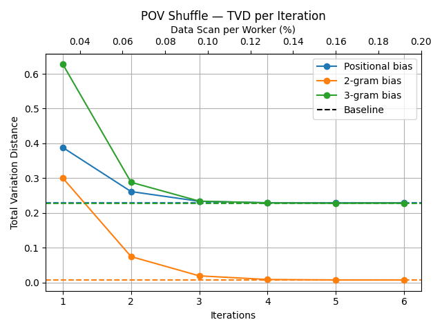
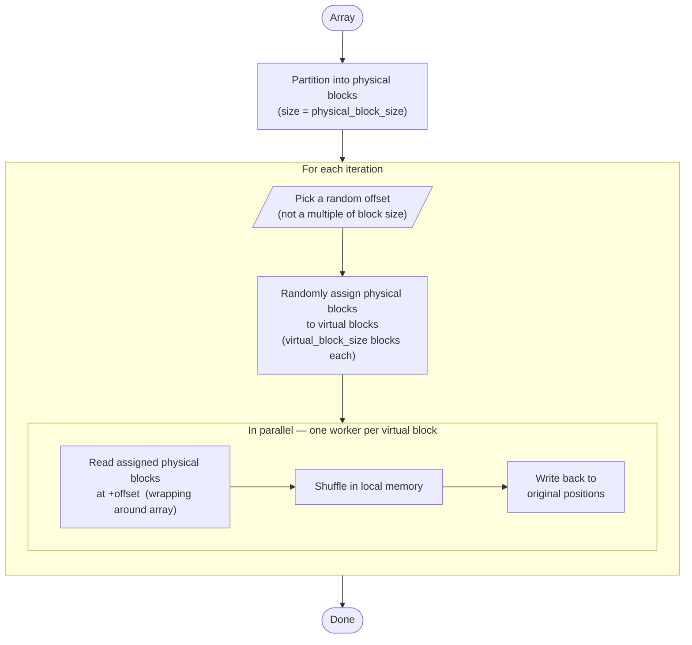
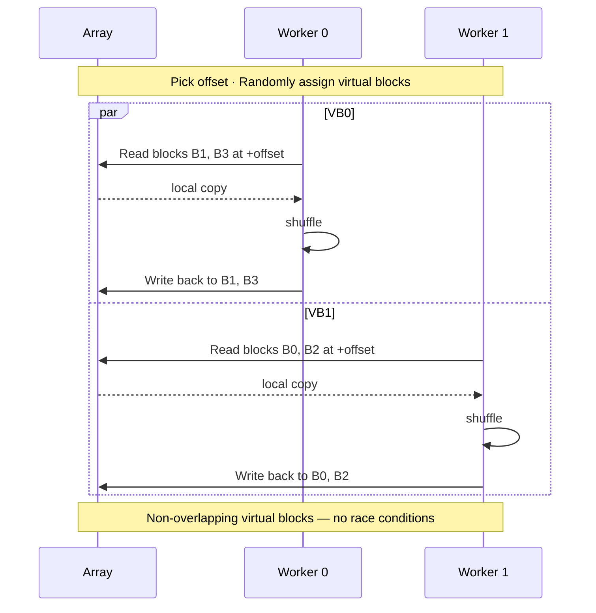

# POV Shuffle
_**P**arallel **O**ffset **V**irtual-block Shuffle_

A parallelizable, iterative algorithm for efficiently shuffling large datasets in place at scale,
while sufficiently approximating a uniform shuffle within few iterations.

## Usage
```python
from povs import POVSOptions, pov_shuffle

pov_shuffle(
    data,  # A numpy array or PyTorch tensor
    iterations=3,
    options=POVSOptions(...),
)
```
- See `help(pov_shuffle)` for more details.

## Installation
```bash
uv add pov-shuffle
```

### Build Customization
Because of optimizations within the CUDA extension, the domain of certain parameters must be specified via environment variables at build time
(see [setup.py](setup.py) for the list of variables and their defaults).

In order to set environment variables consistently across builds we recommend using UV's [`extra-build-variables`](https://docs.astral.sh/uv/reference/settings/#extra-build-variables).
Example:
```bash
# pyproject.toml
[tool.uv]
extra-build-variables = { pov-shuffle = { POVS_CUDA_PBLOCK_SIZES = "42,19,512" } } 
```

## Performance

Total Variation Distance of the POV shuffle distribution when compared to an observed uniform shuffle distribution,
in terms of positional bias an n-gram bias, with the evolution in the number of iterations.

Using a dataset of 1k distinct elements and estimating the distributions from 3k independent shuffling episodes.

[](./data/tvd_per_iter/2026-05-17T23:01:07)

## Algorithm

### How it works
1. Partition the array into physical blocks of a specified size.
2. For each iteration:
   - Pick a random offset, so every block start is shifted from its original position, with the rightmost blocks wrapping around the array.
   - Randomly assign each few physical blocks to a virtual block, so every virtual block is contiguous by parts.
   - Each worker thread shuffles its assigned virtual block in place, using a standard shuffle algorithm (e.g. Fisher-Yates).

Because there is no overlap between virtual blocks, the shuffling can be done in parallel and in-place without facing race conditions.

Compared to a traditional local-block shuffle, the virtual block assignment significantly reduces positional bias,
while the random offset prevents the occurrence of shuffle artifacts from the physical block boundaries.

When applied to higher rank tensors, the shuffle happens along the axis 0,
with each indexable multidimensional object along that axis being treated as a flat 1D instance
(e.g. for a tensor with shape `(I, M, N)`, we shuffle the `I` instances,
each instance being a `(M, N)` matrix treated as an array of length `M*N`).

### Trade-offs

- **Block Size**:
  - Larger blocks (both physical and virtual) increase the portion of the data that needs to be loaded into each worker at each iteration.
  - On the other hand, smaller physical blocks increase the total number of physical blocks, so the host program has to do more non-parallel shuffles when randomly assigning them to virtual blocks.
  - Therefore, as a rule of thumb one should use larger blocks to shorten the time per iteration, or smaller blocks if the priority is reducing the data transfer to workers.
  - Remarkably, so far we have observed little impact of this parameter on the amount of iterations needed for shuffle convergence.

### Diagrams
Algorithm flowchart:


Sequence diagram with 2 workers shuffling 4 physical blocks (2 virtual blocks) in parallel:

