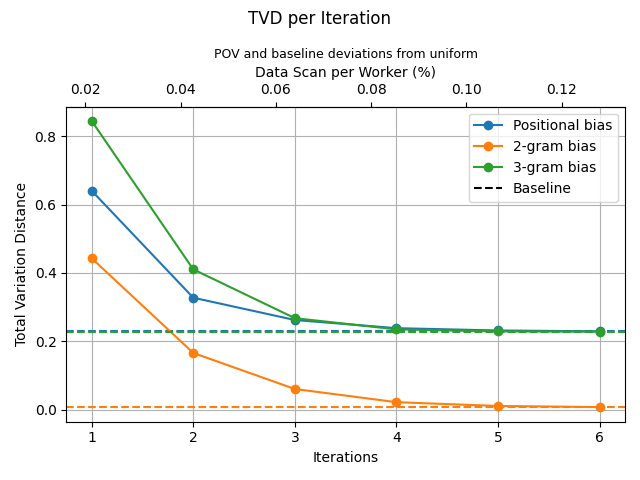
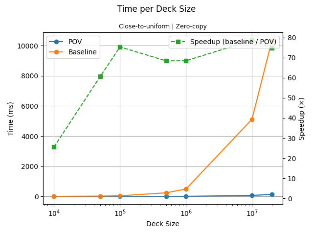
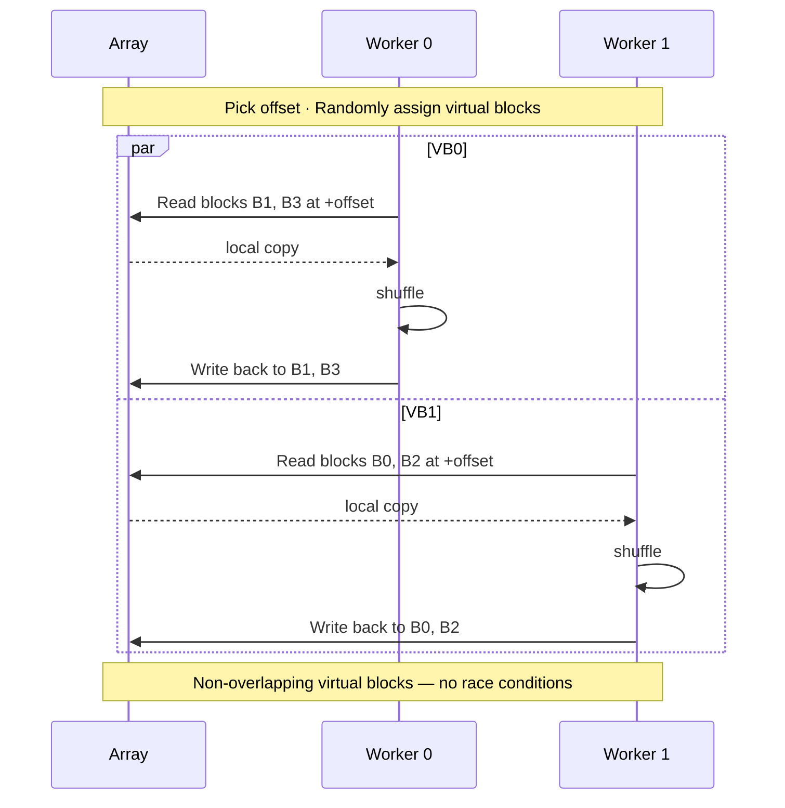

# POV Shuffle
_**P**arallel **O**ffset **V**irtual-block Shuffle_

A fully parallel algorithm for efficiently shuffling large datasets without copy,
while sufficiently approximating a uniform shuffle within few iterations.

## Usage

```python
import povs

# Optional: Optimize algorithm options once for the dataset, to avoid
# overhead when calling `povs.shuffle` multiple times on the same dataset.
options = povs.optim_options_for_dataset(
    dataset,  # A numpy array or PyTorch tensor
)

# Shuffle the dataset in place
povs.shuffle(
    dataset,  # A numpy array or PyTorch tensor
    iterations=3,
    options=options,
)
```
- See `help(povs.shuffle)` for more details.

## Installation
```bash
uv add pov-shuffle
```

### Build Customization
Because of optimizations within the CUDA extension, the possible combinations of certain parameters need to be known at build-time.

See [setup.py](setup.py) for the list of environment variables that can be set at build-time in order to add support for different parameter sets.

In order to set environment variables consistently across builds we recommend using UV's [`extra-build-variables`](https://docs.astral.sh/uv/reference/settings/#extra-build-variables).
Example:
```toml
# pyproject.toml
[tool.uv.extra-build-variables.pov-shuffle]
POVS_CUDA_INSTANTIATIONS = "4,32,64,float;2,64,16,int"  # Add support for 4x32x64xFloat and 2x64x16xInt (VBlockSize x PBlockSize x InstanceSize x DType)
POVS_CUDA_INSTANCE_SIZES = "32,96,128"  # Add support for these instance sizes, in cartesian combination with supported dtypes and supported values of other parameters.
```
- Build parameters can be queried at runtime via `povs.get_build_params()`

## Performance

### TVD

Total Variation Distance of a uniform shuffle distribution against the shuffle distributions obtained from POV and baseline algorithms (`np.shuffle`).
- Assessed in terms of positional bias and n-gram bias, with the evolution of POVS in the number of iterations.
- Using a dataset of 1k distinct elements and estimating the distributions from 3k independent shuffling episodes.

[](./data/tvd_per_iter/2026-06-13T15:33:30)

### Shuffle Time

Shuffle time per deck size with 4-iterations POVS on instances of shape `(128 x float16)`, using the NVIDIA Ada Lovelace architecture.

For a fair comparison with the algorithm, which offers close-to-uniform, zero-copy, in-place shuffling,
the used baseline is `numpy.shuffle`, which is also a uniform shuffle (Fisher-Yates), performed in-place and without copy.

[](./data/time_per_deck_size/2026-06-13T20:54:09)

## Algorithm

### How it works
1. Partition the array into physical blocks of a specified size.
2. For each iteration:
   - Pick a random offset, so every block start is shifted from its original position, with the rightmost blocks wrapping around the array.
   - Randomly assign each few physical blocks to a virtual block, so every virtual block is contiguous by parts.
   - Each worker thread shuffles its assigned virtual block in place, using a standard shuffle algorithm (e.g. Fisher-Yates).

Because there is no overlap between virtual blocks, the algorithm can be fully parallelized without facing race conditions,
and doesn't require a temporary copy of the whole dataset to perform the shuffle in place.

Compared to a traditional local-block shuffle, the virtual block assignment significantly reduces positional bias,
while the random offset prevents the occurrence of shuffle artifacts from the physical block boundaries.

When applied to higher rank tensors, the shuffle happens along the axis 0,
with each indexable multidimensional object along that axis being treated as a flat 1D instance
(e.g. for a tensor with shape `(I, M, N)`, we shuffle the `I` instances,
each instance being a `(M, N)` matrix treated as an array of length `M*N`).

### Trade-offs

- **Block Size**:
  - Larger blocks (both physical and virtual) increase the portion of the data that needs to be loaded into each worker at each iteration.
  - On the other hand, smaller physical blocks increase the total number of physical blocks, so the host program has to do more non-parallel shuffles when randomly assigning them to virtual blocks.
  - Therefore, as a rule of thumb one should use larger blocks to shorten the time per iteration, or smaller blocks if the priority is reducing the data transfer to workers.
  - Remarkably, so far we have observed little impact of this parameter on the amount of iterations needed for shuffle convergence.

### Diagrams
Algorithm flowchart:


Sequence diagram with 2 workers shuffling 4 physical blocks (2 virtual blocks) in parallel:

